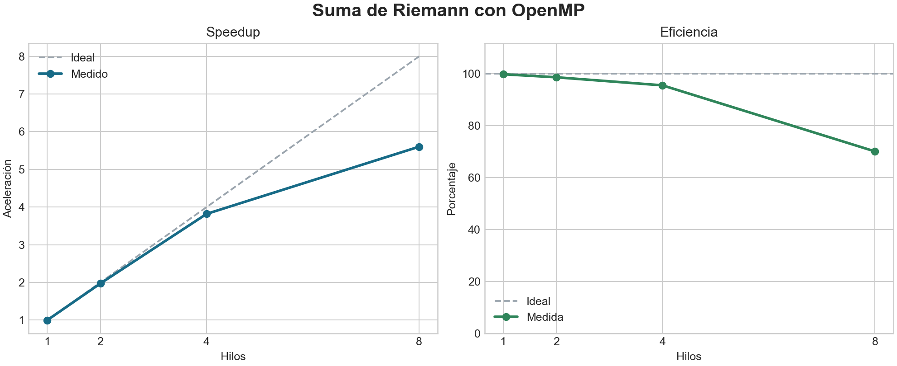
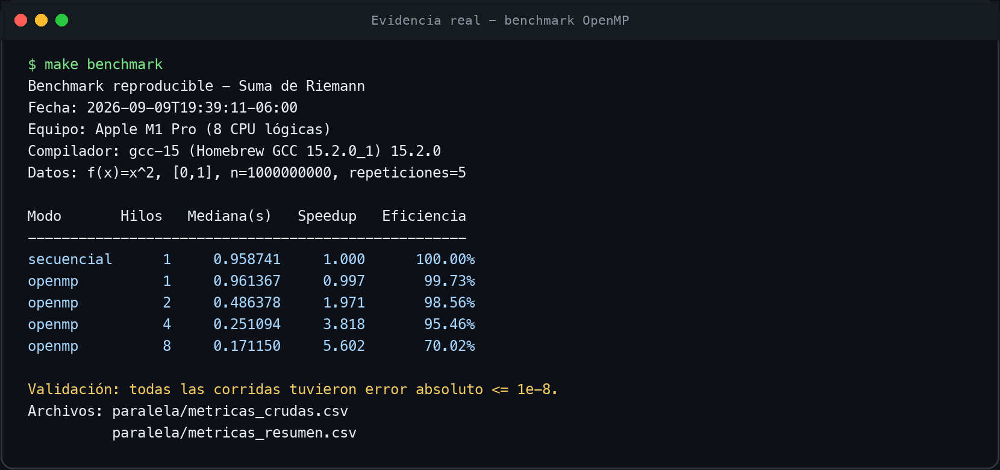

# Suma de Riemann: sección para el informe del parcial

> Alcance: este documento cubre únicamente el algoritmo de Suma de Riemann.
> Debe integrarse con el análisis del segundo problema escogido por el equipo.

**Responsable de esta medición:** `[NOMBRE COMPLETO]`

## 1. Contexto y datos

La suma de Riemann aproxima una integral definida dividiendo el intervalo
`[a,b]` en `n` rectángulos del mismo ancho:

```text
Δx = (b-a)/n
x_i = a+iΔx
área ≈ Σ f(x_i)Δx, para i=0,...,n-1
```

Se implementó la regla de extremos izquierdos. La propuesta secuencial recorre
los índices en orden y acumula cada área en una sola variable. La complejidad es
`O(n)` en tiempo y `O(1)` en memoria: los datos son sintéticos y se generan a
partir del índice, por lo que no se almacena un arreglo de mil millones de
valores.

Para las mediciones se usó `f(x)=x²` en `[0,1]`, cuyo valor analítico es `1/3`,
con `n=10^9` rectángulos. Este tamaño conserva la carga usada en la propuesta
original, hace que el ciclo domine el costo total y reduce la influencia del
tiempo de creación de hilos. El valor exacto permite detectar errores de
implementación; todas las corridas deben tener error absoluto menor o igual a
`10^-8`.

## 2. Estrategia de paralelización

Cada índice produce un rectángulo independiente, así que el ciclo se divide por
iteraciones mediante:

```c
#pragma omp parallel for default(none) shared(a, ancho, n, opcion) \
    reduction(+ : suma_areas) schedule(static)
```

- `parallel for` reparte el espacio de índices entre los hilos.
- `default(none)` obliga a declarar el alcance de las variables y reduce errores
  accidentales de memoria compartida.
- `a`, `ancho`, `n` y `opcion` son compartidas porque solo se leen.
- `i`, `x` y `y` son privadas: `i` lo es por definición del `omp for`, mientras
  que `x` y `y` se declaran dentro del ciclo.
- `suma_areas` causaría una condición de carrera porque cada actualización es
  una lectura-modificación-escritura. `reduction(+:suma_areas)` da un acumulador
  privado a cada hilo y combina los parciales una sola vez al finalizar.
- `schedule(static)` es apropiado porque todas las iteraciones de una corrida
  evalúan la misma función y tienen costo uniforme. El reparto se calcula una
  sola vez, con menos overhead que `dynamic` o `guided`.

No se usó `critical` ni `atomic`: aunque ambas opciones pueden proteger la suma,
serializarían hasta `10^9` actualizaciones y eliminarían gran parte del beneficio
del paralelismo.

## 3. Metodología de medición

Las dos versiones se compilan con el mismo GCC y las mismas banderas base
(`-O3 -std=c11 -Wall -Wextra -Wpedantic`); la versión paralela agrega únicamente
`-fopenmp`. Se mide solo el cálculo de la suma, no la lectura de datos ni la
impresión. Se desactiva el ajuste dinámico de hilos y se prueba con 1, 2, 4 y 8
hilos.

Antes de medir se ejecuta una corrida de calentamiento por configuración. Luego
se realizan cinco repeticiones y se reporta la mediana, que es menos sensible a
interrupciones breves del sistema que una única corrida. Las fórmulas son:

```text
S_p = T_secuencial / T_p
E_p = S_p / p * 100 %
```

Los resultados completos y la evidencia se encuentran en:

- `metricas_crudas.csv`: cada corrida individual.
- `metricas_resumen.csv`: mediana, mínimo, máximo, speedup y eficiencia.
- `riemann_speedup_eficiencia.png`: comparación visual.
- `evidencia_ejecucion.txt`: fecha, hardware, compilador y tabla.
- `evidencia_terminal.png`: captura reproducible de la ejecución.

## 4. Resultados y discusión

Las mediciones se realizaron el 9 de septiembre de 2026 en un Apple M1 Pro con
8 CPU lógicas, usando GCC 15.2.0. El speedup se calculó contra la mediana de la
versión secuencial, no contra OpenMP con un hilo; de esta manera la línea base es
honesta y la versión paralela incluye el overhead real de OpenMP.

| Versión | Hilos | Mediana (s) | Speedup | Eficiencia |
|---|---:|---:|---:|---:|
| Secuencial | 1 | 0.958741 | 1.000 | 100.00 % |
| OpenMP | 1 | 0.961367 | 0.997 | 99.73 % |
| OpenMP | 2 | 0.486378 | 1.971 | 98.56 % |
| OpenMP | 4 | 0.251094 | 3.818 | 95.46 % |
| OpenMP | 8 | 0.171150 | 5.602 | 70.02 % |

El mejor tiempo fue `0.171150 s` con 8 hilos, frente a `0.958741 s` de la
versión secuencial. Esto representa un speedup de `5.602×` y una reducción del
tiempo de aproximadamente `82.15 %`. Con 4 hilos se obtuvo `3.818×` y una
eficiencia de `95.46 %`, un resultado cercano al escalamiento ideal. La versión
OpenMP con un hilo fue `0.27 %` más lenta que la secuencial, lo cual cuantifica
el pequeño costo de entrar a la región paralela incluso cuando no hay reparto
de trabajo.



La aceleración no fue perfectamente lineal. Entre 4 y 8 hilos la eficiencia bajó
de `95.46 %` a `70.02 %`, aunque el tiempo total continuó disminuyendo. Esto es
coherente con la creación y sincronización de hilos, la combinación de la
reducción, la frecuencia distinta de los núcleos del M1 Pro y la competencia por
recursos compartidos. También pueden variar los últimos bits del área: la suma
de punto flotante no es asociativa y OpenMP combina sumas parciales en un orden
distinto. Todas las corridas conservaron un error absoluto menor o igual a
`10^-8`, por lo que la mejora de rendimiento no sacrificó la exactitud definida
para la prueba.



## 5. Reproducibilidad

```sh
make clean
make
make prueba
make benchmark
```

Para el informe final del equipo se debe copiar la tabla producida, insertar la
gráfica y la evidencia, agregar el análisis del segundo algoritmo y completar en
el `README.md` el nombre de la consultora y los tres integrantes.
